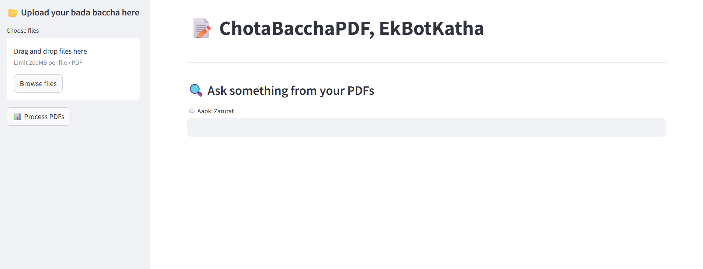

# 🤖 ChotaBacchaPDF: EkBotKatha

A Streamlit-powered conversational app that lets you **talk to your PDFs**!  

**"Chota Baccha samajhke... PDF ko aankh dikhayega?"**

Yes. Yes, it will.

**ChotaBacchaPDF** is a friendly Streamlit bot that takes your boring academic PDFs (or any PDFs, really), chews through them like a FAISS-t beast, and answers your questions using Groq's blazing-fast LLMs.

Whether you're:

- a confused student trying to figure out what are Bi-RNNs in the last minute

- a researcher digging for specific info in dense papers

- or just someone who wants to vibe with a PDF...

This app has your back. No scroll-storming, no ctrl+F nightmares.

**Pehle istemaal karo, Phir vishwas karo.**

---

## 🚀 Features

- 📂 Upload one or more PDF files
- 🧠 Auto-extract and chunk text into embeddings
- 🔍 Ask questions in natural language
- 💬 Get accurate answers powered by **Groq's LLaMA 3**
- 🔍 View which parts of the PDF were used to answer your question
- ✅ All done via Streamlit with no OpenAI costs

---

## 🧱 Tech Stack

| Layer            | Tool                                |
|------------------|--------------------------------------|
| UI               | Streamlit                           |
| PDF Parsing      | PyPDF2                              |
| Text Splitting   | LangChain (RecursiveCharacterTextSplitter) |
| Embeddings       | HuggingFace (`all-MiniLM-L6-v2`)     |
| Vector Store     | FAISS (in-memory)                   |
| LLM              | [Groq API](https://console.groq.com) |
| Prompting        | LangChain `PromptTemplate`           |

---

## 🧪 Landing Page Demo

---

## 🔗 Try the App Live

👉 [**Launch on Streamlit Cloud**](https://chotabaccha--pdf-q-a-bot-leprxnx24ukbtw58zip8ft.streamlit.app/)

---

## 🙏 Special Thanks

- 💬 [Groq](https://console.groq.com) – for blazing-fast LLMs
- 🤗 [Hugging Face](https://huggingface.co/sentence-transformers/all-MiniLM-L6-v2) – for powerful embeddings
- 🧠 [LangChain](https://www.langchain.com) – for making LLM orchestration so easy
- 💡 [Streamlit](https://streamlit.io) – for making beautiful apps in minutes
- 🤝 To all devs who still believe in building cool stuff with free-tier power 😂💪

---

> Made with ❤️ by Ankush Mitra

